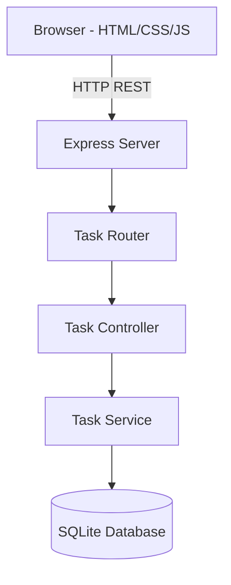

# Architecture

## Mermaid Diagram

## Modules
- **server.js** — Express app, middleware
- **routes/tasks.js** — REST endpoints
- **controllers/taskController.js** — request/response logic
- **services/taskService.js** — business logic
- **db/database.js** — SQLite connection
